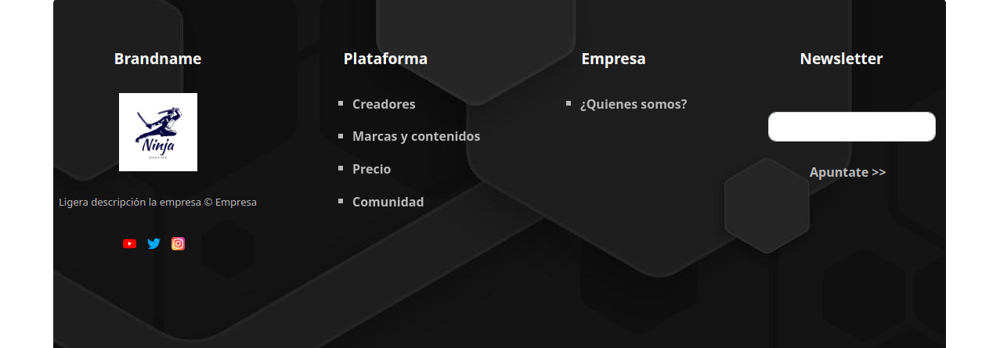

# SIMPLE FOOTER BOOTSTRAP5 
Simple pie de pagina en Bootstrap

## Contenido
Un sencillo pie de página que puedes utilizar en tu sitio web. 
Al estar realizado con **Bootstrap** es responsive y funciona en cualquier navegador moderno.

## Demostración
Si quieres comprobar como queda el proyecto puedes hacerlo en  [Demostración](https://nachosan.com/footer-bs5/)

## Como usarlo
Puedes clonar/Descargar el contenido, adecuarlo a tu sitio y disfrutar del contenido

## Preview

